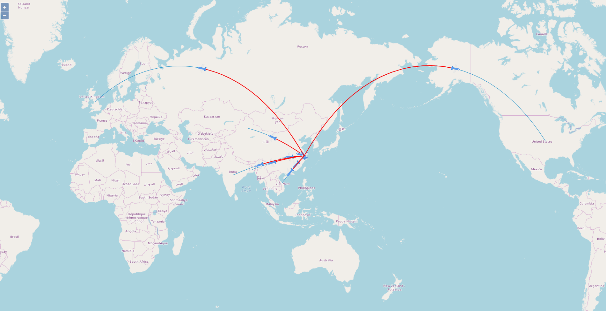

# Route Map

## Show


## Depedency
- [openlayer](https://github.com/openlayers/openlayers)  OpenLayers is a high-performance, feature-packed library for creating interactive maps on the web. It can display map tiles, vector data and markers loaded from any source on any web page. OpenLayers has been developed to further the use of geographic information of all kinds. It is completely free, Open Source JavaScript, released under the BSD 2-Clause License.
- [arc](http://springmeyer.github.io/arc.js/) Calculate great circles routes as lines in GeoJSON or WKT format. 
## Install
Clone the repo using Git:
```
git clone https://github.com/Liar0320/openlayer.track.git
```

Alternatively you can download this repository and then:

```
npm i 
npm run start 
```

## Configuration options

1. 路径坐标文件 /asstes/route.topojson
    ```
    示例
    {
        "flights":[
            [
                [
                    "30.8312277712",
                    "120.9259679951"
                ],
                [
                    "43.7933993081",
                    "87.6270586992"
                ]
            ]
        ]
     }
    ```

2. 从起始点到终点的时间间隔 /src/util.ol.js -> pointsPerMs
    ```
    /** 从起始点到终点的时间间隔 */
    const pointsPerMs = 2000;
    ```

## TODO 
>>待整理